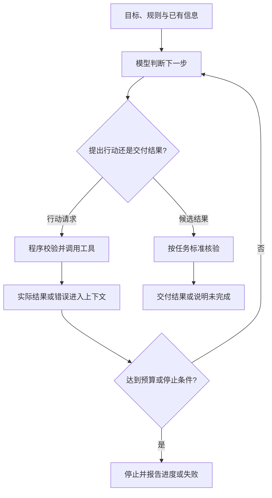

# Agent入门：Workflow、ReAct与平台

> 2026-10-01 学习小节的主干笔记。围绕“LLM 提供智能，Agent 保证结果”整理从受控执行到反馈调整的关系，并在收尾时补充自主反思的边界。`developing` 表示仍可修订，不代表已经实践或个人已经掌握。

## 阅读目标与顺序

本节围绕四个问题展开：模型能做什么、谁决定下一步、谁执行并核验操作、整个系统怎样搭建和管理。

| 阅读顺序 | 要解决的问题 | 阅读位置 |
| --- | --- | --- |
| 1. 建立主线 | 怎样从模型输出走到可核验的任务结果？ | 本文的分工、Workflow、ReAct 与反思部分 |
| 2. 理解实现 | 节点、数据、分支和异常路径如何落地？ | [[Workflow Agent的搭建原理]] |
| 3. 区分推理与行动 | CoT 与工具反馈循环有什么不同？ | [[思维链（Chain-of-Thought）]] |
| 4. 判断职责拆分 | 多模块何时成为多 Agent，是否值得拆？ | [[多Agent与单Agent模块化：区别与选择]] |
| 5. 观察真实平台 | 企业知识、执行和管理如何被集成？ | [[Glean Agent平台：介绍与分析]] |

正文保存可复用结论；个人理解证据与下次入口见 [[2026-10-01 Agent学习记录#学习接续]]。Glean 的时效产品事实保留在独立来源文章中，不复制成稳定的行业结论。

## 核心认识

“LLM 提供智能，Agent 保证结果”可以作为系统分工的愿景，但不能理解成结果必然正确。更准确的工程表述是：

> **模型提供理解、推理与生成；流程和运行程序组织执行；知识与工具补足能力；校验和真实反馈提供结果是否达标的证据。**

本节的学习顺序是“为什么需要控制 → 怎样受控执行 → 哪些决策可以动态交给模型 → 怎样利用反馈修正”。它不是技术发展的历史顺序，也不是 Workflow 必须升级成 ReAct、再升级成多 Agent 的路线。自主程度与可靠性需要分别评估。

### 概念在系统中的位置

| 概念 | 主要回答的问题 | 关键边界 |
| --- | --- | --- |
| LLM | 如何理解信息并生成判断或请求？ | 输出还可以是计划、代码、结构化数据；不只是一段结论 |
| RAG | 如何取回外部资料并用于生成？ | 不等于知识库本身，也不规定任务的控制方式 |
| 工具与代码执行 | 如何取得真实信息、执行操作或计算？ | 调用请求、执行成功和业务正确是不同判断 |
| Workflow | 步骤、条件与数据怎样组织？ | 可包含分支、循环和模型判断，不一定是直线 |
| ReAct | 怎样交替推理与行动，依据观察决定后续行动？ | 不等于所有推理模型或所有工具调用 |
| CoT | 怎样形成中间推理步骤？ | 可在一次生成中完成，不等于外部行动循环 |
| 单／多 Agent | 决策职责分给几个智能体？ | 模块数、模型数和调用次数都不能直接当作 Agent 数 |
| Agent 平台 | 用什么集成构建、运行和管理应用？ | 平台能力不等于某个具体任务的业务逻辑 |

“Workflow Agent”沿用本次学习术语，不视作统一分类。Anthropic 的架构说明将预定义代码路径的 workflows 与模型动态控制流程的 agents 作了区分；这里讨论它们如何服务具体任务，而不依赖名称判断能力。

## 为什么采用工作流：自由度与可靠性的分工

用户提出了三个动机：给模型多大自由空间，如何承接模型无法直接执行的操作，以及如何应对不可靠的规划。这些是工程设计问题；没有课程原材料或历史依据时，不能把它们认定为 Workflow Agent 的确切历史起源。

对于任务边界、步骤和验收条件较清楚的场景，可让模型负责局部理解与生成，让程序规定路径和检查点。模型能够规划，但可能漏掉条件或选择错误工具；把明确规则写进执行系统，可以减少对临时规划的依赖。流程可控仍不代表输入、规则和模型输出都正确。

## 模型与执行系统的分工

### 谁来承接模型的工具调用决策

模型可以输出回答、标签、计划、代码或工具调用请求；多模态模型还可接收图像等输入，具体取决于模型。“只能根据文字输出结论”对输入与输出都限定得过窄。

执行外部操作则需要相应工具与运行环境。三个部分应分开：

| 部分 | 职责 |
| --- | --- |
| 工具定义 | 向模型描述名称、用途、参数和限制 |
| 调度与校验 | 接收调用请求，检查参数、权限与业务前提，决定是否执行 |
| 工具实现 | 运行函数、调用 API 或执行代码，返回实际结果或错误 |

教学示例（未运行，格式不对应特定 API）：

```json
{"tool": "get_order", "arguments": {"order_id": "A123"}}
```

这段输出只表示请求查询。程序还要核验用户能否访问 A123、调用订单服务并返回结果，才算发生了查询。工具可以自行开发，也可以复用函数、API 或平台内置能力；准备完成后通常由程序承接请求，不需要模型每作一次决策就由人临时写工具。

### 用四种工程方式理解模型与系统的分工

| 用户提出的方式 | 在系统中补充什么 | 仍需核验什么 |
| --- | --- | --- |
| 私有知识库与 RAG | 给回答提供相关资料 | 来源质量、召回是否充分、答案是否忠于证据 |
| 设计者定义 Workflow | 给任务提供控制结构 | 路径覆盖、条件和节点结果 |
| 工具调用 | 获取外部事实、执行业务操作或计算 | 参数、权限、真实结果和状态 |
| 模型生成代码，工具运行代码 | 将求解交给程序执行；使用执行工具时属于工具调用的一种 | 数据、程序逻辑和任务口径 |

需要分别确认“生成了代码”“代码运行成功”“实现了正确需求”。例如，要求全体学生平均分，却对人数不同的各班平均分直接取平均，程序即使不报错，统计口径仍可能错误。这个反例是教学设计，未运行。

工具既补足裸模型的外部行动能力，也能承担模型能尝试但不够稳定的工作。增加 RAG、工具或代码执行中的任意一项，并不自动构成自主 Agent。

## Workflow Agent：把智能放进预定义流程

Workflow Agent 在本资料中指由预定义流程组织模型、工具和规则的系统。其基本构件是：**节点、连接与条件、数据与状态、运行程序**。节点可以是普通代码、模型调用、工具或子流程，不一定是独立 Agent。

“预定义”主要指控制结构，而不是预先知道每个输出。模型可以分类并影响分支，流程也可以并行、循环或嵌入动态 Agent。步骤较明确时，这便于检查和定位问题；遗漏路径仍需补充规则、说明无法处理或转人工。

搭建可以从已有模型和工具开始，通常无须为流程编排训练新模型：

**定义任务与完成标准 → 拆节点 → 约定输入输出 → 连接分支与异常路径 → 用代码或平台运行 → 验证端到端结果。**

完整的退款资格查询案例、数据约定与流程图集中保存在 [[Workflow Agent的搭建原理]]，本文不再重复展开。

## Workflow 与 RAG 的关联、区别与协作

Workflow 组织“执行哪些步骤、何时分支或停止”；RAG 解决“取回哪些资料，并怎样用于生成”。两者可以组合：

- 已学过的“Query 处理 → 检索 → 过滤或重排 → 组装上下文 → 生成”可以实现成一个工作流。
- 更大的业务 Workflow 可以调用 RAG 子流程。单独的检索节点只完成检索部分，不等于完整 RAG。
- 工作流也可以组织离线解析、切片和建索引；这些准备工作不同于一次在线问答。
- 动态 Agent 同样可以检索资料或调用 RAG 子流程，使用 RAG 并不决定控制方式。

在退款资格案例中，API 提供真实订单状态，检索提供政策证据，明确业务规则核验资格，模型组织有依据的解释。Workflow 规定这些步骤和异常路径；资格符合不等于已经执行退款。详细原理见 [[读取文件(检索增强生成 RAG)]]。

## ReAct Agent：依据行动反馈决定下一步

ReAct 是 **Reasoning + Acting（推理与行动）**，强调交替推理和任务行动，让行动获得的信息用于后续判断。仅说“推理型智能体”会遗漏行动与反馈。

### 已有 Workflow，为什么还需要 ReAct

一些任务很难提前完整列举具体步骤。例如修复程序时，测试失败可能要求读取另一个文件、检查依赖或重改代码。外层仍可规定“定位—修改—验证”，局部行动则需要根据反馈选择。

ReAct 提供了这种动态调整的方法，但没有消除规划错误；模型仍可能误读反馈、选错工具或反复尝试。区别不是有没有分支和循环，而是具体行动如何决定。工程适用场景也不等于论文的历史动机：ReAct 原研究关注推理与行动的协同，并非证明它应取代 Workflow。

### 基本循环

入门可概括为“推理 → 行动 → 观察 → 更新判断”，直到完成或触及限制。每轮判断结合目标、已有信息和新反馈，不只看最后一条结果；也不要求每次机械输出三段固定格式。



这是工程教学图，不是原论文算法的逐项复现。工具返回的 Observation 来自实际环境；模型自己写出的“查询结果”不能代替它。结果核验方式由任务决定，不能把另一次模型认可当作确定正确的证明。

### 相邻两轮调用的上下文怎样变化

```text
第一轮输入：任务规则 + 用户目标 + 工具说明 + 已有信息
模型输出：查询订单 A123 的请求
工具返回：已发货，物流单号 L456
第二轮输入：相关原有上下文 + 上轮调用记录 + 实际工具结果
模型输出：查询物流 L456 的请求，或信息已足够时形成回答
```

以上是教学示例，未运行。这里的 Prompt 应理解为广义输入上下文；API 中常使用结构化工具调用和结果消息，不一定改系统提示词。平台或应用负责保存并传入相关信息，通常不靠每轮更新模型权重来记忆。

实际系统可以筛选、压缩历史，也会更新任务状态和剩余预算；不是永久逐字追加所有内容。继续判断所需的信息与调用—结果对应关系应保留。关联 [[记忆能力(短期记忆与上下文窗口、长期记忆与数据库)]]。

### 推理自由度与行动约束

灵活选择路径不等于无限推理：单次调用受到上下文、输出长度等限制，任务循环还需时间、调用次数、成本或无进展停止条件。

| 约束位置 | 要解决的问题 |
| --- | --- |
| 指令与工具说明 | 模型应围绕什么目标，如何使用工具？ |
| 工具暴露范围 | 当前任务能请求哪些能力？ |
| 程序与服务端 | 参数、对象访问权限和业务前提是否满足？ |
| 执行环境与运行限制 | 代码能访问哪些资源，何时停止或要求审批？ |

可以允许模型动态组合工具，无须穷举所有行动序列。但“Prompt 中写禁止越权”和“执行系统拒绝越权”是两层工作。即使工具名称在允许列表中，通用代码工具的文件、网络等资源访问也需要实际约束。

CoT 与这一循环的区别见 [[思维链（Chain-of-Thought）]]：中间推导可以在一次生成中完成；ReAct 的环境交互引入实际行动结果。推导文字、行动请求和外部观察不能混为一谈。

## 从行动反馈到自主反思

本次详细讨论了 ReAct 的反馈循环；“自主反思”在阶段收尾时作为主题方向提出，下面只补充必要区分，不视为已经完成相关算法学习。

| 要区分的过程 | 简化例子 | 不应自动推出什么 |
| --- | --- | --- |
| 依据观察调整行动 | 查询得知地址异常，下一步查配送处理办法 | 不必然有独立的反思阶段 |
| 评价并修改当前产物 | 检查报告遗漏哪些证据，再补充报告 | 不保证自评正确，也不要求多 Agent |
| 保存经验用于后续尝试 | 记录上次失败原因，下次尝试时作为参考 | 不等于在线更新模型权重或持续自我训练 |

Self-Refine 研究同一模型生成反馈并迭代修改输出；Reflexion 则研究依据任务反馈形成反思文本，保存到记忆中用于后续尝试。这些是具体方法例子，“反思”本身不是唯一、统一的算法名称。依据见文末两篇论文摘要。

反思关注“如何评价并修正已有结果或策略”，ReAct 关注“如何交替推理、行动与观察”。二者可以结合；评价—修改循环也能预先编排进 Workflow，因此不能把反思当作只属于高自主 Agent 的能力。

反馈来源与评价标准仍然重要：模型自评是一项判断，测试、业务状态或外部证据可以提供额外校验。反复修改是否改善结果需要评测，不能因为系统能写反思文本就认定更可靠。

## Agent 平台：构建和运行系统的环境

Agent 平台是为应用提供可复用构建、运行与管理能力的集成软件环境，帮助组合模型、指令、工具、数据与控制逻辑。具体产品覆盖范围不同，并无本节统一规定的必备功能清单。

| 生命周期 | 观察平台提供什么支持 |
| --- | --- |
| 构建 | 配置模型与指令，接入工具和资料，定义编排 |
| 运行 | 接收任务，调度调用，传递状态，处理异常 |
| 管理 | 查看记录，评估结果，控制访问并维护应用 |

LLM 提供模型能力；具体 Agent 应用面向一个任务；框架／SDK 提供代码组件与运行机制；平台提供集成环境。框架也可以有运行时、持久化与调试能力，产品边界可能重叠，不能用“框架不能运行”来区分。

Dify 的节点编排与日志、LangGraph 的框架／运行时及 LangSmith 的平台能力，是此前查阅的术语实例，不构成本节的产品排名。平台可以呈现为画布，也可以主要通过 API 使用。

[[Glean Agent平台：介绍与分析]] 是本节独立产品案例：观察企业知识接入、Auto／Workflow、工具执行与应用治理如何组合。功能应按文章记录的文档版本理解；未进行租户实测，也不能直接将 Auto mode 等同于原论文的 ReAct。

## 三者怎样比较与协作

Workflow 是较宽的流程编排方式，ReAct 是推理与行动交替的具体方法，平台承载其实现；它们不构成互斥、穷尽的分类。

单／多 Agent 则讨论决策职责的拆分。多个模块不一定是多个 Agent；组件能否承担局部目标、依据反馈继续决定行动，是一个实用观察点。详见 [[多Agent与单Agent模块化：区别与选择]]。

### 贯穿案例：调查订单未送达

以下为助手教学设计，未调用真实系统；同一任务可以采用不同架构。

| 环节 | 如何组织 | 对应概念 |
| --- | --- | --- |
| 1. 明确任务 | 解释未送达原因，给出下一步建议；修改订单另需授权 | 目标与完成标准 |
| 2. 校验输入 | 提取订单号，检查字段及访问权限 | LLM + 固定 Workflow + 程序校验 |
| 3. 调查异常 | 查订单后再决定查物流、库存还是配送说明 | 可采用 ReAct；也可预先编排覆盖已知分支 |
| 4. 形成依据 | 取回适用说明，结合业务事实生成解释 | RAG、工具与上下文 |
| 5. 检查并交付 | 核验事实与解释是否一致；不足则补查或说明无法确认 | 结果验证；评价—修改是可选设计 |
| 6. 提供使用环境 | 接入服务、运行应用、观察错误并维护版本 | Agent 平台 |

如果任务确实包含相对独立的调查方向，可以委派给多个 Agent，再汇总核对；没有这类需要时，单 Agent 加模块或明确流程也可能足够。

同样一串查询记录，既可能来自固定工作流，也可能来自动态选择；判断要看决策机制。选型从任务和瓶颈出发，比较正确性、依据、耗时与成本，而不是追求更多 Agent 或更多轮次。

## 后续学习与修订问题

这四道题用于检验易混边界，尚未作答，不要求先做完才继续学习：

1. Workflow 中用 LLM 分类后进入不同分支，为什么仍可能是预定义流程？如果某节点自行调查多轮，又如何描述这个系统？
2. 模型写出“订单已退款”，需要什么证据才能确认？工具请求成功、接口返回成功和业务结果正确是否完全等价？
3. 单次 CoT、根据工具结果继续行动、评价后修改答案，分别新增了什么信息？其中哪些可以放进 Workflow？
4. 三个不同角色 Prompt 为什么不必然等于三个 Agent？什么时候拆成多个 Agent 才值得？

后续可先用一个小任务标注目标、行动、观察、状态和停止条件，再进一步学习反思的反馈来源与评测；目前尚未实现或评测系统，也未完成平台选型。新课程材料与实践结果出现时，按对应章节修订，不把本次学习顺序当成架构优劣或历史结论。

## 来源与核验

- 学习出处：用户于 2026-10-01 列出三个学习主题，随后提出工作流的三个设计动机及“让模型提供智能，Agent 保证结果”的表述；未提供课程出处或时间戳，不能确认这些表述是否为课程原话。校准与教学示例为助手补充。
- [Anthropic：Building effective agents](https://www.anthropic.com/engineering/building-effective-agents)：支持 workflows 与 agents 的架构区别、预定义任务的可预测性、程序检查点、工具交互与实际反馈，以及这些模式可以组合；不是“Workflow Agent”名称的统一标准，也不证明任何系统能保证结果正确。
- [ReAct: Synergizing Reasoning and Acting in Language Models](https://arxiv.org/abs/2210.03629)：支持推理与行动交替、通过行动获取外部信息并更新计划的解释。
- [ReAct 作者项目页](https://react-lm.github.io/)：支持经典提示示例包含推理、行动与环境观察，并展示方法的失败案例；不据此声称所有现代工具调用都属于 ReAct。
- [PAL: Program-aided Language Models](https://arxiv.org/abs/2211.10435)：2026-10-01 查阅摘要，支持模型生成程序、解释器执行求解的分工；不证明生成代码或执行结果必然正确。平均成绩反例是助手教学补充，未运行。
- [MCP 工具规范（2025-06-18 版本）](https://modelcontextprotocol.io/specification/2025-06-18/server/tools)：2026-10-01 查阅，支持工具输入结构、未知工具或无效参数处理，以及输入校验、访问控制、调用限流和超时的执行层约束。本资料以该版本作实例依据，不宣称它是最新版本或 ReAct 的必需协议；推理预算及代码运行环境的分工为助手工程归纳。
- [Claude：Vision](https://platform.claude.com/docs/en/build-with-claude/vision) 与 [Tool use](https://platform.claude.com/docs/en/agents-and-tools/tool-use/overview)：2026-10-01 查阅，分别作为图像输入、模型输出工具调用请求及客户端／服务端执行工具的实例依据。Tool use 的客户端示例明确将前次模型响应和实际工具结果追加到消息，再进行后续模型调用，支持相邻轮次的上下文衔接说明。不将具体产品能力外推为所有模型共有能力；历史筛选和预算管理为工程实现选择。
- [Retrieval-Augmented Generation for Knowledge-Intensive NLP Tasks](https://arxiv.org/abs/2005.11401)：支持检索外部非参数化记忆用于生成的基本机制。“Workflow 组织步骤、RAG 提供检索增强生成”的关系，是结合该论文、Anthropic 架构说明与现有 [[读取文件(检索增强生成 RAG)]] 的工程归纳，不是原论文对 Workflow Agent 的分类。
- [Dify：Workflow & Chatflow](https://docs.dify.ai/en/cloud/use-dify/build/workflow-chatflow)：作为画布节点编排与会话应用的平台实例；不据此推断所有平台都支持同样能力。
- [Dify：Orchestration Logic](https://docs.dify.ai/en/cloud/use-dify/build/orchestrate-node)：支持串行、并行、变量引用和循环的产品实例。
- [Dify：Logs](https://docs.dify.ai/en/cloud/use-dify/monitor/logs)：支持运行结果、节点记录、延迟和 Token 使用等观察能力的产品实例；本文不涵盖套餐价格或保留期。
- [LangGraph overview](https://docs.langchain.com/oss/python/langgraph/overview)：2026-10-01 查阅，支持框架／运行时也能提供状态与执行能力，以及 LangSmith 作为追踪、评估和部署平台的术语实例。平台定义、生命周期和层次对照为助手跨资料归纳，不是该文档给出的统一行业标准。
- 上述资料于 2026-10-01 查阅，是助手补充依据，不是用户原课程出处。
- 本文于 2026-10-01 阶段收尾时按问题主线重组。对照表、控制流程图、选择建议与案例是助手工程归纳或教学设计，未实现或实测；用户理解证据另见 [[2026-10-01 Agent学习记录]]。

- 本次收尾补充：[Self-Refine: Iterative Refinement with Self-Feedback](https://arxiv.org/abs/2303.17651)，2026-10-01 查阅摘要，支持同一模型生成反馈并迭代修改输出，无须为该过程额外训练；不据此保证每次修改都改善结果。
- 本次收尾补充：[Reflexion: Language Agents with Verbal Reinforcement Learning](https://arxiv.org/abs/2303.11366)，2026-10-01 查阅摘要，支持依据任务反馈形成反思文本、保存于情节记忆并用于后续尝试，区别于更新模型权重。这里只作概念边界说明，尚未学习或实现完整算法。

## 关联

- [[AI工程系统]]
- [[读取文件(检索增强生成 RAG)]]：知识增强与执行编排是可组合的维度。
