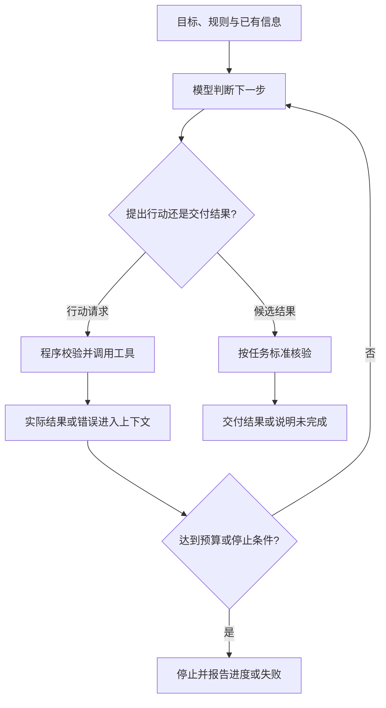

# ReAct

## 核心认识

ReAct 是 **Reasoning + Acting（推理与行动）**，强调交替推理和任务行动，让行动获得的信息用于后续判断。仅说“推理型智能体”会遗漏行动与反馈。

### 已有 Workflow，为什么还需要 ReAct

一些任务很难提前完整列举具体步骤。例如修复程序时，测试失败可能要求读取另一个文件、检查依赖或重改代码。外层仍可规定“定位—修改—验证”，局部行动则需要根据反馈选择。

ReAct 提供了这种动态调整的方法，但没有消除规划错误；模型仍可能误读反馈、选错工具或反复尝试。区别不是有没有分支和循环，而是具体行动如何决定。工程适用场景也不等于论文的历史动机：ReAct 原研究关注推理与行动的协同，并非证明它应取代 Workflow。

### 基本循环

入门可概括为“推理 → 行动 → 观察 → 更新判断”，直到完成或触及限制。每轮判断结合目标、已有信息和新反馈，不只看最后一条结果；也不要求每次机械输出三段固定格式。



这是工程教学图，不是原论文算法的逐项复现。工具返回的 Observation 来自实际环境；模型自己写出的“查询结果”不能代替它。结果核验方式由任务决定，不能把另一次模型认可当作确定正确的证明。

### 相邻两轮调用的上下文怎样变化

```text
第一轮输入：任务规则 + 用户目标 + 工具说明 + 已有信息
模型输出：查询订单 A123 的请求
工具返回：已发货，物流单号 L456
第二轮输入：相关原有上下文 + 上轮调用记录 + 实际工具结果
模型输出：查询物流 L456 的请求，或信息已足够时形成回答
```

以上是教学示例，未运行。这里的 Prompt 应理解为广义输入上下文；API 中常使用结构化工具调用和结果消息，不一定改系统提示词。平台或应用负责保存并传入相关信息，通常不靠每轮更新模型权重来记忆。

实际系统可以筛选、压缩历史，也会更新任务状态和剩余预算；不是永久逐字追加所有内容。继续判断所需的信息与调用—结果对应关系应保留。关联 [[记忆能力(短期记忆与上下文窗口、长期记忆与数据库)]]。

### 推理自由度与行动约束

灵活选择路径不等于无限推理：单次调用受到上下文、输出长度等限制，任务循环还需时间、调用次数、成本或无进展停止条件。

| 约束位置 | 要解决的问题 |
| --- | --- |
| 指令与工具说明 | 模型应围绕什么目标，如何使用工具？ |
| 工具暴露范围 | 当前任务能请求哪些能力？ |
| 程序与服务端 | 参数、对象访问权限和业务前提是否满足？ |
| 执行环境与运行限制 | 代码能访问哪些资源，何时停止或要求审批？ |

可以允许模型动态组合工具，无须穷举所有行动序列。但“Prompt 中写禁止越权”和“执行系统拒绝越权”是两层工作。即使工具名称在允许列表中，通用代码工具的文件、网络等资源访问也需要实际约束。

CoT 与这一循环的区别见 [[思维链（Chain-of-Thought）]]：中间推导可以在一次生成中完成；ReAct 的环境交互引入实际行动结果。推导文字、行动请求和外部观察不能混为一谈。

## 与反思的关系

ReAct 根据环境观察决定后续行动；对产物进行评价、修改或保存经验，是可与它组合的设计。完整区别见 [[Agent入门：Workflow、ReAct与平台#从行动反馈到自主反思]]，不能仅凭模型生成反思文本就认为结果更可靠。

## 来源与核验

2026-10-03 从 [[Agent入门：Workflow、ReAct与平台]] 提取，学习出处为 [[2026-10-01 Agent学习记录]]；原课程、视频与时间戳未提供。以下查阅记录沿用 2026-10-01 的核验范围，本次没有重新测试工具、平台或模型。

- [ReAct: Synergizing Reasoning and Acting in Language Models](https://arxiv.org/abs/2210.03629)：支持推理与行动交替、通过行动获取外部信息并更新计划的解释。
- [ReAct 作者项目页](https://react-lm.github.io/)：支持经典提示示例包含推理、行动与环境观察，并展示方法的失败案例；不据此声称所有现代工具调用都属于 ReAct。
- [MCP 工具规范（2025-06-18 版本）](https://modelcontextprotocol.io/specification/2025-06-18/server/tools)：2026-10-01 查阅，支持工具输入结构、未知工具或无效参数处理，以及输入校验、访问控制、调用限流和超时的执行层约束。本资料以该版本作实例依据，不宣称它是最新版本或 ReAct 的必需协议；推理预算及代码运行环境的分工为助手工程归纳。
- [Claude：Vision](https://platform.claude.com/docs/en/build-with-claude/vision) 与 [Tool use](https://platform.claude.com/docs/en/agents-and-tools/tool-use/overview)：2026-10-01 查阅，分别作为图像输入、模型输出工具调用请求及客户端／服务端执行工具的实例依据。Tool use 的客户端示例明确将前次模型响应和实际工具结果追加到消息，再进行后续模型调用，支持相邻轮次的上下文衔接说明。不将具体产品能力外推为所有模型共有能力；历史筛选和预算管理为工程实现选择。
- 图示、订单相邻调用与运行限制为工程教学归纳，未实现或实测；不是对原论文算法的逐项复现。

## 关联

- [[工具调用与执行系统]]：行动请求与实际执行的分工。
- [[思维链（Chain-of-Thought）]]：中间推导与外部行动反馈的区别。
- [[AI工程系统]]：工程导航。
