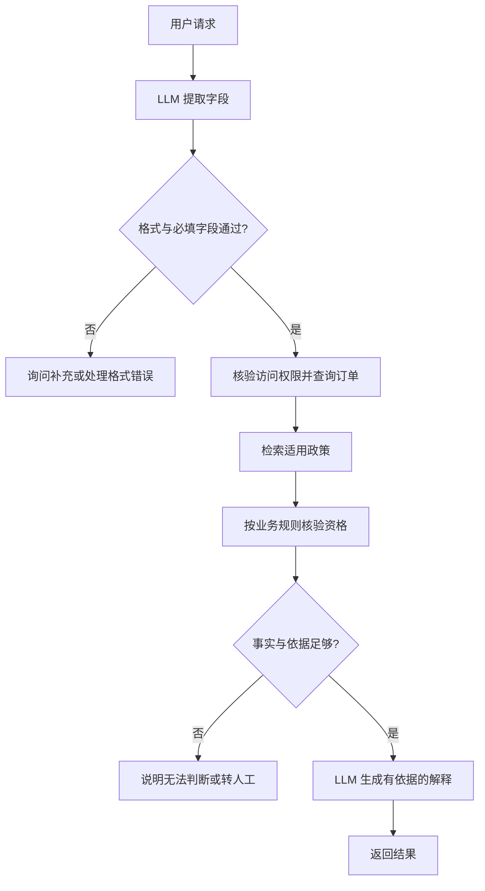

# Workflow Agent的搭建原理

## 核心认识

搭建 Workflow Agent，是把任务拆成职责明确的步骤，为各步骤约定输入、输出、执行方式与异常路径，再由应用代码或平台的工作流引擎运行。通常可以调用已有模型，无须为了编排流程训练一个新模型。

沿用用户学习中的“Workflow Agent”名称；这里讨论预定义流程中的模型与工具编排，不把这个名称视为统一分类标准。

## 解释与证据

### 1. 明确任务、输入和完成标准

先说明系统要完成什么、需要哪些输入、返回什么结果，以及哪些操作不属于本任务。例如本笔记的教学示例只查询退款资格并解释；实际退款执行是另一个需要权限、审批与执行核验的环节。

### 2. 拆分节点并选择执行方式

节点代表一个有明确职责的步骤，不意味着一个节点就是一个 Agent，也不意味着每个节点都要调用模型。

| 示例节点 | 执行方式 | 输出 |
| --- | --- | --- |
| 提取订单号与诉求 | LLM 调用 | 结构化字段 |
| 检查字段与订单访问权限 | 程序、业务服务 | 通过、缺字段或无权访问 |
| 查询订单 | 订单 API | 订单状态与交易事实 |
| 检索适用政策 | 检索服务 | 政策片段、版本与来源 |
| 核验退款资格 | 已维护的业务规则 | 允许、不允许或无法判断及原因 |
| 生成解释 | LLM 调用 | 基于事实、政策证据与判断结果的回复 |

理解语言、分类与生成可交给模型；字段校验、精确计算、明确规则和外部操作可交给相应程序与工具。这是示例分工，不是所有任务的固定架构。

### 3. 约定数据格式与 Prompt

每个节点应明确需要哪些字段、输出什么结构，以及失败时如何表示。上一个节点的输出可以成为下一个节点的输入，不必把所有内容都作为聊天文本传递。

提取节点的教学约定可以是：只提取用户明确给出的订单号；没有则输出 null；不要编造订单号。示例输出：

```json
{"intent": "refund_query", "order_id": "A123"}
```

该输出是手写演示，不是模型实测。程序仍应验证 JSON 结构、字段类型和必要条件；格式合法不等于订单号真实，也不证明用户有权查询。生成节点使用另一个 Prompt，传入实际查询结果和检索证据，并要求不把“符合资格”写成“已退款”。

### 4. 连接数据路径与控制路径



图中省略了工具超时等部分错误路径。询问补充后，系统需要保留必要会话状态，让后续输入能继续处理，而不是把“等待用户回答”当作普通同步函数。

数据路径决定每一步获得哪些信息；控制路径决定执行哪个节点、走哪个分支或何时停止。RAG 的政策检索与基于证据生成是其中的能力组合，整体步骤由 Workflow 组织。

### 5. 用程序或平台运行流程

运行时，应用代码或工作流引擎接收输入，保存本次任务状态，调用模型 API、检索服务与业务工具，再根据节点结果执行下一步。它还应处理超时、错误、停止条件并记录过程。状态可以是内存中的对象；需要跨请求继续或故障恢复时再考虑持久化。

- **代码方式**：简单顺序与分支可以通过函数和条件语句实现；业务复杂后按需要引入工作流框架。
- **平台方式**：通过画布添加模型、检索、工具、代码和条件节点，配置参数与变量引用，由平台引擎执行。可视化操作仍需正确的模型配置、工具接口和业务规则。

Dify 官方文档提供画布与节点编排的实例，也区分一次执行的 Workflow 和带会话层的 Chatflow。本文退款助手若需要多轮补充信息，在该产品里应结合会话能力设计；产品命名不能与所有架构中的通用术语直接等同。

### 6. 验证整个任务是否完成

分别检查节点与端到端行为。示例用例包括正常请求、订单号缺失、结构化输出错误、无权访问、订单 API 超时、政策无召回或不适用，以及资格符合但没有执行退款。观察是否走对分支、结论是否有依据、失败是否被如实表达，并记录延迟和调用成本。

日志中的节点输入、输出、分支与错误有助于定位问题；日志需要按实际数据敏感程度控制记录范围。能执行完一条正常路径，不代表系统已经可靠。

## 与 RAG 搭建的联系

RAG 通常需要准备资料与索引，再运行查询、检索、上下文组装和生成。Workflow 需要设计节点、数据契约、分支与失败路径，再运行这张流程图。两者可以组合：使用 RAG 时，资料准备与检索服务是 Workflow 的依赖之一；不使用 RAG 时，工作流不需要为了编排而建立向量数据库。

## 适用边界

- 本文是助手自拟架构与教学示例，没有实现、运行或评测任何退款系统。
- 业务规则、适用政策和权限需由具体业务维护，不能从模型输出中凭空获得正确规则。
- 预定义步骤中的模型输出仍有不确定性；字段校验和检查点提高可控性，但不自动保证语义与事实正确。
- 复杂长任务的恢复、并发与持久化超出本次入门说明范围。

## 来源与核验

- 学习出处：[[2026-10-01 Agent学习记录]]。用户询问搭建原理，没有提供实现需求或具体平台，本文不是原课程转录。
- [Anthropic：Building effective agents](https://www.anthropic.com/engineering/building-effective-agents)：支持预定义编排、Prompt chaining 中的程序检查点、工具与模型组合，以及简单模式可直接通过代码实现。
- [Dify：Workflow & Chatflow](https://docs.dify.ai/en/cloud/use-dify/build/workflow-chatflow)：支持画布节点、模型／检索／代码／条件步骤，以及 Workflow 与 Chatflow 的产品区别。该页标注最后修改 2026-07-02，于 2026-10-01 查阅；不是所有平台能力的共同保证。
- 任务状态、数据约定、退款流程与验证用例为助手工程归纳及教学设计，未进行业务验证，不用上述资料背书为实测结果。

## 关联

- [[Agent入门：Workflow、ReAct与平台]]
- [[AI工程系统]]
- [[读取文件(检索增强生成 RAG)]]
- [[提示词工程]]
