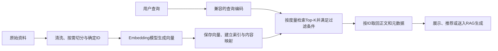

# 向量数据库

## 核心认识

向量数据库是围绕**向量的存储、索引与近邻查询**组织的数据库系统。它帮助回答：“给定一个查询向量，哪些已存储对象在指定度量下最接近它？”实际产品还会提供不同程度的数据增删改、元数据过滤、持久化与服务接口。

[[Embedding(嵌入)]] 解决“如何把对象表示成向量”；向量数据库解决“如何管理这些向量并找到近邻”。文本语义由表示模型及训练任务决定，数据库依照数值执行检索，不会自动修复模型对否定、事实或关系的误判。

## 从酒店推荐理解为什么需要它

[[酒店内容推荐案例：TF-IDF、N-Gram与余弦相似度]] 把 152 家酒店的描述表示成 152×3347 的稀疏矩阵，再计算 152×152 的相似度矩阵。这个小案例用内存矩阵就能完成推荐，没有使用向量数据库。

若改成“用户随时输入一句需求，在很多酒店中查找候选”，可以先为每家酒店保存表示，再只计算当前查询的近邻。这里的查询和酒店表示必须兼容：用 TF-IDF 时应共享词表与 IDF；用学习型 Embedding 时应使用兼容的模型、维度与输入配置。

数据量、查询并发、更新和持久化需求增长后，逐个手写管理向量与原文会变得繁琐，才有理由引入检索库或数据库。**使用向量表示不自动意味着必须使用独立向量数据库**；小规模精确计算也可能足够。

## 一条记录包含什么

以助手自拟的酒店记录为例：

```text
ID: hotel_001
Vector: [0.12, -0.31, ...]        ← 描述的数值表示
Content: “酒店有室内泳池，靠近地铁站。”
Metadata: {city: Seattle, price: 180, source: brochure_v2}
```

- **Vector** 用于近邻比较，不是可直接读回原文的编码文件。
- **ID** 用于准确定位一条记录，让向量与正文建立对应关系。
- **Content / Metadata** 用于取回正文、展示来源、筛选城市或价格；可以同库存储，也可以按 ID 去外部存储查询。

三者的具体映射与一致性问题见 [[向量检索中的ID与元数据]]。向量库保存的向量通常来自文本、图片等，但“原始内容非结构化”与“库存的是数值数组”要分清。

## 写入与查询是两条流程



切分应服务于任务：长文档可以按内容块索引，课件的四条短文本则直接逐条编码。查询向量和文档向量不仅要维度相同，还要处于兼容的表示空间；只把两个不同模型都设为 1024 维，不能保证可以比较。

Top-K 表示最多取 K 个近邻候选。依据 [[余弦相似度]] 或点积时常按分数由大到小，依据 [[欧氏距离与平方欧氏距离]] 时按距离由小到大。索引可采用精确或近似搜索，见 [[向量近邻检索：精确搜索与近似搜索]]。

## 与关系数据库、检索库和知识库的关系

这些名称描述的重点不同，不是相互排斥的产品清单：

| 层次 | 主要职责 | 例子及边界 |
| --- | --- | --- |
| 向量检索库／索引 | 在程序内建立索引、搜索向量 | [[FAISS]]；正文、服务与业务数据管理需由应用组合 |
| 向量数据库 | 管理向量记录并提供数据库查询与存储能力 | Qdrant 是具体例子，支持向量附带 JSON Payload 及过滤 |
| 关系数据库的向量扩展 | 在现有关系数据管理中增加向量类型与搜索 | PostgreSQL 的 pgvector 支持精确和近似近邻查询 |
| 知识库 | 管理知识内容、可信来源、版本和使用责任 | 可以组合上述技术，也可以用关键词或 SQL；详见 [[知识库与向量数据库]] |

课件列举了 Milvus、Pinecone、Weaviate、Qdrant、Elasticsearch 和 FAISS。应先判断属于什么组件、需要补哪些职责，再讨论选择；课件中“领先”“性能最好”等表述缺少同条件基准，不作为当前性能结论。

“传统数据库只能精确匹配、无法做向量检索”过于绝对。pgvector 就是反例。语义候选检索与城市、价格、时间等结构化条件常需要组合，不能让语义分数替代明确的业务条件。

## “长期记忆”与适用边界

课件把向量数据库称为大模型的长期记忆。工程上可以理解为：**资料保存在模型之外，需要时检索少量相关内容，再放进当前上下文**。

外部资料可以更新，但检索注入本身不改变 LLM 权重，也不取消上下文窗口限制。数据库命中只证明在某个表示与度量下接近，不证明内容真实、最新或足以回答；见 [[向量相似不等于语义一致]]。

选型时可依次检查：

1. 任务表示与度量是否适配，少量样本的精确检索是否能找到相关内容。
2. 数据规模与延迟是否需要近似索引，能够接受多少近邻遗漏。
3. 是否需要过滤、频繁更新、持久化、并发服务与恢复；现有数据库能否承接。
4. 使用自己的数据比较效果、成本和维护责任，而不是仅按产品宣传排序。

这是助手补充的选择路径，未进行产品性能对比。详细的模型选择属于 [[文本表示方案的选择：TF-IDF、词向量与句子向量]]；数据库选择不能代替模型效果评估。

## 来源与核验

- 学习出处：[[AI大模型应用课件：Embedding与向量数据库]]，PDF 第 40–47、55–57 页；酒店数据规模来自此前已执行的案例。
- [Qdrant 官方仓库](https://github.com/qdrant/qdrant)：核对向量记录可附带 JSON Payload，以及按字段过滤的能力；仅作类型例证。
- [pgvector 官方仓库](https://github.com/pgvector/pgvector)：核对 PostgreSQL 扩展支持向量及精确／近似查询，校准“关系数据库无法做向量搜索”的表述。
- FAISS 的组件边界和接口依据集中在 [[FAISS#来源与核验]]。本次未部署数据库、未进行产品基准或远程 Embedding 调用。

## 关联

- [[AI工程系统]]：按表示、存储、检索与生成的职责进入。
- [[FAISS文本检索案例：向量、ID与元数据]]：课件展示的一次完整写入与查询。
- [[RAG（检索增强生成）]]：怎样把检索内容用于生成，区别于单纯返回近邻。
