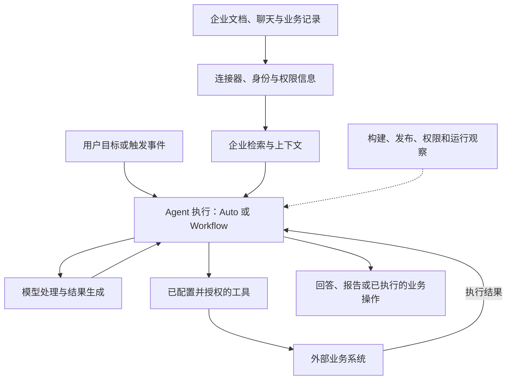

# Glean Agent平台：介绍与分析

**Glean 可以用来理解这样一种 Agent 平台：以企业知识与工作场景为基础，连接检索、模型、工具和应用管理，让员工能够使用和搭建面向具体任务的智能体。** 官方将整体产品定位为 Work AI 平台，Glean Agents 是其中的智能体能力。[Glean Agents 产品页](https://www.glean.com/ai-agents)

对于我们正在学习的三个概念，Glean 是“平台”层面的案例；在平台中搭建的会议准备助手或工单处理助手，才是具体 Agent；这些应用可以采用不同的执行方式。

> 本文依据 2026-10-01 查阅的官方网页与文档。各页更新时间不同，见文末；没有一个经核实、适用于全部功能和全部租户的统一生效日，因此 `as_of` 留空，访问日期单独记录。功能说明不等于实测结论；本文没有登录企业租户测试，分析与教学设计会明确标注。

## 一、从企业的实际问题理解 Glean

设想一家公司的知识分散在文档、聊天记录、项目工单和业务系统中。员工想知道“某客户的交付为什么延期”，往往需要先判断去哪里找，再逐个检索、对照日期和责任人，最后整理结论。

Glean 的企业搜索试图统一这类信息入口：连接不同工作应用，在原有访问权限的基础上检索，并结合语义搜索和企业内部的人员、内容及互动关系帮助查找资料。[Enterprise Search](https://www.glean.com/enterprise-search)

当检索能力与模型、工具结合，可以把员工的需求分成三个层次：

| 员工的需求 | 需要完成的工作 | 在学习中的对应关系 |
| --- | --- | --- |
| “找到这个客户的项目文档” | 检索相关资料 | 搜索与知识接入 |
| “根据资料解释延期原因” | 阅读、比较和生成回答 | 检索增强生成，即 RAG 的典型思路 |
| “调查原因并建立后续跟进事项” | 组织步骤，并调用业务工具 | Agent 与执行环境 |

这是帮助理解产品的分层方式，不是 Glean 官方内部架构图。它说明，企业知识问答可以成为 Agent 的一项能力，而 Agent 还需要解决行动、流程和运行管理的问题。

## 二、为什么称它为平台

单个助手解决一个任务，平台提供多个任务可以复用的支撑能力。理解 Glean 时，可以沿着下面这条路径观察：

上图是依据公开能力整理的教学示意，省略了内部服务、存储和网络部署细节，不代表官方实现拓扑。

平台性还体现在应用复用上。Glean 的 Agent Library 让员工按权限查找、收藏和运行 Agent，并提供公司审核标识、分类等组织方式。因此，一个团队配置的应用可以成为其他员工的工作入口。[Agent library](https://docs.glean.com/agents/concepts/agent-library)

这里可以推导出一个产品分析判断：**流程编辑器解决“怎样搭建”，应用目录和管理机制解决“搭建后怎样被组织使用”。** 后一部分也是企业平台的重要价值。

## 三、企业上下文：让模型获得与这家公司有关的信息

通用模型并不天然知道公司内部的项目进度、术语、人员职责和历史决策。Glean 的 Enterprise Context 产品说明强调连接企业应用，并通过 Enterprise Graph 组织人员、内容及活动关系。[Enterprise Context](https://www.glean.com/platform/enterprise-context)

可以用一个教学例子理解这些关系：同一份设计文档，如果知道它属于哪个项目、谁负责维护、与哪个工单相关，就比一段脱离背景的文本更容易被用于回答业务问题。这是对“企业上下文”用途的解释，不是对 Glean 排序算法的逆向描述。

它与 RAG 的联系是：**当系统取回相关企业资料，再将这些资料交给模型生成答案，就体现了 RAG 的基本机制。** 但企业知识接入还涉及身份、权限、同步和关系信息，不能把整个平台缩写成“向量数据库加聊天框”。

这里也有两个判断边界：有 Enterprise Graph，不足以证明所有检索都采用某一种 GraphRAG 算法；让模型在回答时读取私有知识，也不等于把这些资料训练进基础模型权重。本文没有核实其全部内部检索算法或训练流程。

## 四、Auto 与 Workflow：在同一平台里分配决策权

官方文档区分两种 Agent 构建与执行模式：Auto mode 根据目标动态决定执行路径；Workflow mode 由构建者明确配置步骤和控制逻辑。前者适合开放式研究、分析等任务，后者适合需要固定顺序的重复流程。[How agents work](https://docs.glean.com/agents/how-agents-work)

| 观察维度 | Auto mode | Workflow mode |
| --- | --- | --- |
| 主要描述什么 | 目标、指令及可用能力 | 步骤、顺序和分支规则 |
| 具体路径如何产生 | 执行中动态选择 | 依据预先配置的流程推进 |
| 教学用例 | 调查延期原因，按发现继续寻找证据 | 收集指定材料，检查字段，生成固定格式简报 |

与我们学习的 ReAct 联系起来看，Auto 的动态工具选择体现了“根据当前信息决定后续行动”的思路。**但当前查阅资料不足以证明 Auto mode 就是原论文的 ReAct 实现。** 工具调用、动态规划与 ReAct 有关联，不能直接画等号。

这也说明 Workflow 和动态 Agent 不必被理解为两代相互替代的产品。对于同一家企业，不同任务可能需要不同程度的自由：资料调查可以灵活，字段校验和操作条件则应清楚定义。这一段是工程分析，不是 Glean 效果优于其他平台的证据。

## 五、从“输出决定”到“实际操作”

Glean 的工具可以承接创建工单、查询记录、更新字段等操作。官方提供原生工具，并支持从自定义 MCP 服务接入工具；管理员可以配置连接认证、启用具体操作，以及限制可调用的用户或群组。[Tools overview](https://docs.glean.com/administration/tools)

这正好对应之前讨论的执行分工：

> 模型生成调用请求 → 平台调度已配置的工具 → 外部系统执行 → 实际结果回到 Agent。

因此，“模型认为应该创建工单”和“工单已经创建成功”是两件事。后者需要业务系统返回可核对的执行结果。

同样，**某个数据源能够被搜索，不意味着 Agent 自动获得对它的修改权限。** 检索接入、工具启用和目标系统授权要分别理解。是否要求用户确认写入也取决于配置，不能假定平台中的每次写操作都必然人工确认。[工具配置与执行选项](https://docs.glean.com/administration/tools)

对自建系统的团队而言，平台可以减少连接、调度和管理的重复工作；但如果业务系统没有现成接口，仍可能需要开发专用工具。平台不会自动补齐所有业务能力，这是基于工具接入方式作出的分析。

## 六、多步任务如何传递信息

Glean 的 Workflow 记忆机制会保存步骤输出，默认后一步接收紧邻前一步的输出；构建者可以调整可见历史，或显式引用指定步骤结果。Company search 默认将相关片段加入上下文，也可配置读取完整文档，但会增加 Token 消耗。[Memory](https://docs.glean.com/agents/concepts/memory)

这为此前“下一轮输入增加行动与反馈”的理解提供了一个具体产品例子：**系统确实需要传递前面的结果，但不一定把完整历史全部追加进去。** 实际工程中还要选择哪些信息值得保留，哪些可以通过摘要或字段传递。

这里的工作记忆主要是运行中的信息组织，不能据此认定模型在任务执行时更新了权重。记忆配置也会影响效果：漏掉关键依据，后续判断可能失去条件；塞入大量无关内容，则会占用上下文预算。

## 七、权限与治理为何不能只看一个开关

讨论企业 Agent，需要区分三个问题：谁能使用或编辑这个 Agent，运行时能读取什么资料，以及工具能执行什么操作。

Glean 将 Agent 的分享、编辑与发布权限作了区分。文档访问规则还与使用入口有关：网页端依据登录用户的文档权限；Slack 中仅对请求者可见的回答采用个人权限，而频道公开回答采用 broad-access 规则，默认使用组织内公开内容及可识别的当前频道消息，不能简化为逐一校验每位频道成员的文档权限。[Sharing and permissions](https://docs.glean.com/agents/concepts/sharing-permissions)

这个细节的学习价值是：**“遵守权限”必须落到身份、入口和输出受众上理解。** 同一个 Agent 换到另一个入口，可能获得不同的可用资料；不能仅凭一句产品宣传判断全部权限行为。

治理还包括运行后的维护。官方 Agent 开发生命周期指南覆盖任务定义、质量标准、测试发布、版本管理和持续维护。[Agent development lifecycle](https://docs.glean.com/agents/agent-development-lifecycle/adlc) Agents insights 则提供使用情况和反馈等观察能力，部分图表取决于工作区配置。[Agents insights](https://docs.glean.com/agents/concepts/insights)

从分析角度看，这些能力让 Agent 有机会成为持续维护的企业应用。但活跃用户数、运行次数和点赞率都不能直接代替结果正确率；平台给出观察工具，组织仍需定义业务验收标准。

## 八、贯穿案例：客户会议准备与后续跟进

下面是基于上述能力设计的教学场景，**未在 Glean 租户中搭建或运行，也不表示所有配置均开箱即用**。

目标是：“为明天与客户 A 的会议准备一份简报，列出待解决问题，并为确认要跟进的问题建立工单。”

1. **明确输入。** 指定客户、时间范围和简报格式；客户名称存在歧义时先澄清，避免检索错对象。
2. **取得证据。** 从已接入且有权限的资料中查找项目说明、近期讨论及相关工单，保留日期和来源。
3. **组织调查。** 固定模板可以采用 Workflow；如果要追查“为什么延期”，可考虑 Auto 式的动态调查，是否足够可靠需要样例评测。
4. **生成简报。** 把事实、推断和缺失信息分开，避免把过时讨论当成当前状态。向后续步骤传递必要信息，不必反复传入所有原文。
5. **承接行动。** 本例设计为先由用户确认跟进事项，再通过已授权工具创建工单。这是本例的流程选择，不是对 Glean 默认确认策略的断言。
6. **核对结果。** 依据工具返回的工单标识等确认实际创建情况；如果失败，区分未执行、部分完成和结果不明，避免盲目重复创建。

在这个案例中，RAG 支撑“找到并使用资料”，模型负责提炼和判断，Workflow 或动态 Agent 机制组织步骤，工具执行业务操作，而 Glean 提供连接和管理这些组件的环境。

这也将“模型提供智能，Agent 保证结果”修正得更准确：**平台和执行机制可以提高可控性与可验证性，结果是否正确仍依赖资料、模型判断、工具实现和业务检查。**

## 九、怎样评价 Glean 的价值与局限

以下是依据公开能力作出的分析，尚未经过真实租户对照实验。

Glean 值得关注的地方，是把企业知识入口与任务执行环境放到一起。如果企业资料跨多个工作系统，员工又频繁需要查找、综合并采取行动，那么共用的知识接入和管理能力可能减少各团队重复建设。Agent 目录则有助于让做好的应用被更多人找到和复用。

这类价值有明显前提：资料要能接入，身份与权限映射要准确，任务需要有足够稳定的业务定义。源文档互相矛盾、重要决策只存在于人的记忆里，或旧权限本来就授予过宽，都不是增加一个 Agent 就能解决的问题。

另外，连接越多系统，持续维护的范围也可能越大：认证失效、接口变动、资料同步和工具错误都需要有人负责。迁移时也应评估 Agent 配置、上下文引用和运行记录的可迁移性；本文未核实具体导出能力与合同条款。

| 企业情况 | 初步判断与需要验证的重点 |
| --- | --- |
| 知识分散，跨团队查资料和跟进频繁 | 有理由试点，重点验证能否找全资料并缩短完整任务耗时 |
| 已使用 Glean 搜索，希望增加任务执行 | 可以评估既有知识接入能复用多少，以及新增工具授权与管理成本 |
| 只有少量固定文档，需要简单问答 | 先比较较简单的检索问答方案，确认是否需要平台的其他能力 |
| 任务高度依赖专有系统、复杂事务或特殊部署约束 | 先验证接口、执行控制和部署条件，不能只看演示判断适用性 |

如果要判断“这个平台对我们的业务是否好用”，可以选一组真实任务，对照现有人工过程，记录证据覆盖、答案正确率、操作正确率、总耗时，以及人工复核和维护成本。使用量增长只能说明有人使用，不能单独证明节省了净成本。

本文不作采购推荐，也未核实合同价格、具体套餐、部署条款或各租户开通范围；厂商页面中的效果宣传不作为本文的实测结论。

## 来源与后续核验

本文的产品描述来自官方资料，工程解释和适用性判断由助手整理。文档更新时间仅标识页面版本，不等于功能上线日或全量开放日期。

| 已查阅资料 | 页面标示的更新时间 | 本文主要使用范围 |
| --- | --- | --- |
| [Glean Agents](https://www.glean.com/ai-agents) | 未标明 | 产品定位与平台概览 |
| [Enterprise Search](https://www.glean.com/enterprise-search) | 未标明 | 企业检索与权限基础 |
| [Enterprise Context](https://www.glean.com/platform/enterprise-context) | 未标明 | 企业上下文与关系信息 |
| [How agents work](https://docs.glean.com/agents/how-agents-work) | 2026-09-25 | Auto、Workflow 两种模式 |
| [Tools overview](https://docs.glean.com/administration/tools) | 2026-09-23 | 工具接入、认证与控制 |
| [Memory](https://docs.glean.com/agents/concepts/memory) | 2026-09-30 | 工作流步骤上下文 |
| [Sharing and permissions](https://docs.glean.com/agents/concepts/sharing-permissions) | 2026-09-30 | 分享、发布与不同入口的资料权限 |
| [Agent library](https://docs.glean.com/agents/concepts/agent-library) | 2026-09-21 | 应用发现与复用 |
| [Agent development lifecycle](https://docs.glean.com/agents/agent-development-lifecycle/adlc) | 2026-09-25 | 从任务定义到持续维护 |
| [Agents insights](https://docs.glean.com/agents/concepts/insights) | 2026-08-27 | 使用与反馈观察 |

后续如果能实际搭建一个小型 Agent，应优先验证：Auto 如何选择工具、不同身份和入口的结果差异、工具失败时的处理方式，以及模型回答与真实业务结果如何核对。当前这些实践仍未完成。

概念回顾：[[Agent入门：Workflow、ReAct与平台]] · [[Workflow Agent的搭建原理]] · [[读取文件(检索增强生成 RAG)]]。
