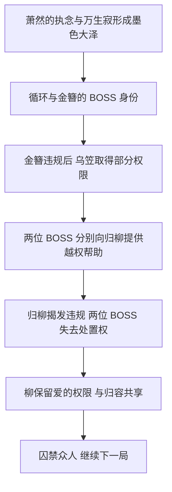

# 《既往》主持人手册分析

> 全剧透。新增来源为 [M：完整主持人手册转换稿](../../../20_Sources/Files/PDFs/既往剧本杀/_extracted/完整主持人手册-ceee1992fea9/document.md)，共 173 个 PDF 物理页。本轮按页通读文字，与 v0.1 复盘交叉核对。下文的页码均指物理页码，不是手册印刷页码。综合后的故事见[故事总览](故事总览.md)，长期证据及问题状态见[时间线与证据](时间线与证据.md)。

## 一、手册让故事发生了哪些实质变化

最重要的变化是：这场故事的结尾已经能确认是**多方有意推动、由归柳接管并继续的囚困**。它既包含人物争取自己的生路，也包含对别人自由的主动剥夺。与此同时，主持人可以选择不同的金簪身份、许尽欢结局演绎与谢幕方式，因此不能把所有段落都当成同一场次同时发生的事实。

| v0.1 的认识 | 手册新增事实 | v0.2 的处理 |
| --- | --- | --- |
| 金簪的身份不能只凭演员重合判断 | 第 170 页明确提供“金簪就是阿蒲”和“金簪是全新灵魂”两种版本 | 保留分支；不选定唯一身份。 |
| 乌笠与云谦的关系缺乏直接证据 | 第 169—171 页摘面具、称风清雁为女儿，并交代因执念取得部分 BOSS 权限 | 确认终局父亲身份的延续；具体转变过程仍缺人物小传。 |
| 归柳成为 BOSS，是否终止循环未知 | 第 168—170 页明确说要困住其他人无限轮回，还指定下一局主题 | 明确他们延续循环，不把局部团圆写成全体解放。 |
| 莲心珠废珠的去向有缺口 | 第 153 页两珠暂时取出；第 148、159 页说明云妄故意只毁一珠，让废珠继续灼烧风清雁 | 主体规则已解；角色本“胸口碎珠”与手册“取出后毁珠”仍保留表述差异。 |
| 云谦以自身性命补阵 | 第 150—151 页先以无上宗来人的生命补阵，再用自己补最后缺口 | 改为杀敌取命与自我牺牲并存，保留其伦理代价。 |
| 云谦杀纪泽苍等人的动机待核 | 第 150 页直接说明：纪泽苍和原江寒知晓云妄身份、阻碍计划；莲心长老逼死风怜并困住女儿 | 补入直接供述，不把动机当作正当性证明。 |
| 淮朝死于假死符骗局 | 第 121 页说他根本没带符，知道弟弟要做什么；第 124 页主动耗尽命数破阵、要求删除自己 | 被骗的是许尽欢；淮朝之死同时包含知情赴死，不能写成他也单纯相信骗局。 |
| 风清雁换 B 本的准确操作未知 | 第 105—106、112—113 页明确收走旧本、交付 B 本二，第五六幕划掉父亲相关内容，第七幕换成爱情故事 | 换本是对她人生被改写的现场呈现，非两个连续篇章。 |

## 二、从“谁写故事”到“谁控制游戏”

### 1. 循环的起源与金簪的分支

终局第 166 页由金簪说明：阿蒲死后，萧然因爱而生的执念与万生寂共同幻化出墨色大泽；他种下蒲公英，使之成为金簪，并赋予她 BOSS 身份。萧然把自己和其他人困在循环中，以惩罚自己曾经伤害阿蒲。

这补足了“因萧然执念循环”的具体内容：他不只是始终放不下爱人，循环还带有**自我惩罚**的性质，并把别人一同卷入。

但这段共同前提并不直接决定金簪是不是阿蒲。第 170 页明列两个选开版本：

- **版本一，金簪就是阿蒲。** 她一直看着萧然折磨自己，厌倦 BOSS 身份，找到违反规则、降级为玩家的办法，以便回到他身边一起沉沦。
- **版本二，金簪是因萧然执念产生的新灵魂。** 她知道萧然仍爱阿蒲，要求他在两者之间表态，并利用自己已降级、二人将被新 BOSS 留住的局面，宣称他再也逃不开。

不能把版本一解释为版本二的伪装，也不能把版本二当成对版本一的最终揭穿。手册把它们列为可供主持人选择的不同结局，并要求参阅金簪小传。〔M，165—170；E18〕

### 2. 乌笠要的不是 BOSS 地位

第 169 页，乌笠摘下面具，叫风清雁“雁雁”，说已经替她取得自由，要她离开。第 170—171 页进一步说明，他因执念，在金簪第一次违规降格后取得部分 BOSS 权限，最在意的是让女儿自由，而不是自身的名号或权限。

因此可以确认，终局乌笠承接云谦的父亲身份和愿望。尚不能仅凭这份手册补出他怎样从沧灵之死走到 BOSS 身份、第一次违规发生于哪一轮、其间经历了多少次循环。

这里也解释了为什么金簪和乌笠互相利用却目标不同：金簪的结局围绕与萧然同处，乌笠的目标是送风清雁离开。将二者概括为单纯争权，会漏掉他们真正想交换的东西。〔M，168—171；E18〕

### 3. 归柳如何接管

结算并不是归柳用武力击败 BOSS，而是抓住规则，证明二者都使用了故事内不应存在的资源：

| 资源／行为 | 结算指向谁 | 对接管的作用 |
| --- | --- | --- |
| 以阿蒲之名给归容的锁灵符 | 金簪 | 归容指出这不是阿蒲能给出的东西，而是 BOSS 越权干涉进程。 |
| 消除万生寂的符、带云笙神魂的镜片、复活币 | 乌笠 | 柳沐瑶指出乌笠同样违规，且帮助更多。 |
| 关于“爱”的权限 | 金簪交给柳沐瑶 | 在两位 BOSS 都失去处置权后，柳成为仍有游戏权限的人，并与归容共享。 |

复活币不能简单只归给某一人：终局先感谢乌笠提供包括复活币在内的帮助，再指出金簪交付“爱”的权限，让柳顺利得到它。这是两边资源合作产生的结果；完整兑换规则仍需星愿池／权限资料。〔M，167—168；E18〕

归柳也不是从此对所有人宽容。他们宣布把游戏变成真正的关门阵，永远困住他人，让其他人见证两人的爱。这里把云笙曾经保护柳沐瑶的“关门”意象，变成了柳沐瑶控制别人的方式。

风清雁看似可以选留下陪父亲或通关离开，但新 BOSS 的指令规定：她愿意留下，游戏继续；她不愿意，就以“不可忤逆金簪”的规则判定通关失败。乌笠为她赢得的离开机会，最终被归柳再度剥夺。〔M，163、168—169；E18〕

图表示手册交代的因果关系，不代表已补齐所有历史轮次。

### 4. “墨镜人”是可选的进一步反转

第 20 页先规定：NPC 戴墨镜意味着退出角色，以 DM 身份指导玩家。第 172 页则提供可选谢幕：三位 DM 戴墨镜，质问归柳是否真的自由，因为他们每句话、每个动作都是 DM 教的。

这是对“夺得权限就掌握命运”的又一次质疑。但它标明“可选”“慎选”，随后还安排开玩笑式收场。因此应作为可选元叙事尾声记录，不能强行宣布所有版本都有一个已获世界观确认的“墨镜人最高神”。〔E19〕

## 三、两颗莲心珠：原有疑点怎样闭合

手册补出的关键是：**取出是暂时的，彻底毁掉则需要另一步。**

1. 第四幕，风清雁把有效珠交给江寒，以此救他。换珠使有效珠的因果逐渐向他转移；归容的锁灵符加速并压过云谦自身意识。没有锁灵符也会转移，不是符纸凭空创造了全部关系。〔M，89、111—113〕
2. 风清雁与云谦、云笙后来计划补全镇渊卷轴，暂时取出两人身上的珠子，再让两珠相撞、彻底湮灭。〔M，147—148〕
3. 云谦补阵后，云笙明确宣布两珠均已取出，只差相撞。〔M，153〕
4. 云妄有意抢先毁掉原属风清雁的有效珠，阻止原属自己的废珠一起湮灭。他要杀死父亲、留下灼烧，逼风清雁永远记住自己；手册既在场外行动引导里说明，也在最终输出中再次确认。〔M，148、159〕
5. 卷轴只能暂时取珠，废珠没有被毁，结合 G-B，61 左“废珠会回到风清雁体内”的复盘，原先的“回到”便有了流程上的解释。

所以，云妄摧毁有效珠包含对杀母之物的报复，也包含对风清雁的继续伤害。即便他宣称爱她，也不能将这一行为改写为悔悟后送她彻底自由。

**仍须保留一处文本差异：** J-B，57—59 写有效珠在云妄胸口被压制、碎裂；M，153 说两珠已被取出，M，159 又沿用“体内”称呼。主线目的和废珠后果一致，但珠子的即时物理位置表述不完全一致。本稿不擅自发明“取出后又塞回去”的步骤。〔E14；Q02〕

## 四、云谦：真挚父爱与主动杀人同时成立

### 1. 旧案动机已经可以分开记录

第 149 页无上宗指控云笙盗取镇渊卷轴；第 150 页云谦将责任揽在自己身上，并承认诸案。这段要区分“谁执行盗取”与“谁为此杀人／承担责任”。

| 对象 | 云谦在台上给出的理由 | 判断边界 |
| --- | --- | --- |
| 莲心城长老 | 逼死风怜、困住风清雁 | 复仇及解除控制的动机明确；不能据此推定每个长老的具体行为。 |
| 枪仙纪泽苍、真正的羽幽江寒 | 知道云妄身份，阻碍计划 | 不是误会后被洗清；手册明确保留他为计划除去知情者的事实。 |
| 无上宗及镇渊卷轴相关旧案 | 女儿需要卷轴，他为此不惜杀人 | 结合角色本所述仙长死亡，可以解释其目的；具体盗取、杀人时间和分工仍待 NPC 手册。 |

这里的“他们该死”是云谦对自己行为的判断，不是复盘文档对这些死亡的裁决。

### 2. 终战不是只用自己的命

云谦说，一城之石需以一城之人的性命填补。他先宣布用无上宗来人的命补阵，随后交战杀敌，最后在“还差一点”时以自己的性命补齐。手册没有给出精确死亡人数，不能自行填成整座城或整个宗门已全部死尽。

这比“云谦牺牲自己救下所有人”更尖锐：他爱女儿，也愿意为女儿杀别人；最后并没有因牺牲自己而让先前的代价消失。与此同时，他向归容交付酒葫芦／宗主身份，并说十年前救他无悔，说明他对弟子的情感也真实存在。〔M，150—152；E15〕

### 3. 失忆与伪装的准确分界

第八幕现场结束前，云笙破开锁灵符，云谦伸手似要摸女儿的头，却转而继续否认她，随后吐血。第九幕第 152 页亲口确认：破符时已经想起，但若相认，云妄就会借珠取他性命，让风清雁继续被威胁。

因此 v0.1 的主要判断成立，但现场时间要修正为**第八幕末解除锁灵符，第九幕揭示恢复后仍在伪装**，而不是第九幕才破符。〔M，142—143、152；E17〕

## 五、淮朝之死：骗局没有解释完他的选择

归容确实捅下刀，许尽欢也确实被假的假死符欺骗。但淮朝随后明确说自己没有带那张符，并知道弟弟的打算。接下来，他以剩余命数破阵，是为了送许尽欢回家；临终还要求她删除自己，停止让自己在故事里反复寻找、爱上她并赴死。〔M，119—124；E13〕

于是需要同时保留三件事：

- **归柳的意图**是利用淮朝之死破阵，骗局针对许尽欢求救的希望。
- **淮朝的知情与行动**不能被抹去。他没有把符当成保命凭据，死亡演绎还包含主动耗尽命数。
- **回家的承诺并未立刻兑现。** 淮朝以为或希望完成剧情可以送走许尽欢，但第八幕她仍留在故事中，不能把人物临终的愿望当作当场生效的系统规则。

许尽欢最终的删除也不是只停留在文稿任务：手册第 147、163 页要求玩家亲手把淮朝文件夹拖进回收站并确认，随后播放小程序内容。可以选择的是第九幕先去，还是看完演绎再去；流程不提供“永久拒绝删除”的分支。

第 14 页区分 HE 中出现淮朝、BE 中出现陆淮朝；第 169—170 页写明最终淮朝再次入场，两种版本有不同私语。BE 私语保留“我不知道自己到底是淮朝还是陆淮朝”的身份疑问，不能擅自替他定案。完整视频和 HE／BE 的选定规则依然未提供。〔E16〕

## 六、如何理解那些相互矛盾的“我爱你／我从未爱过你”

这份手册不能被当成全部由全知叙述者说出的真相。里面有四种不同文字：后台调度、场外引导、角色台词、可选演绎。它们的作用不同。

例如，云谦第一幕关于淮夜已死的说法仍是当时公开的身份掩护；第 26 页的“世界观总结”也沿用这个阶段性认知，不能因它写在主持人手册里就覆盖后续归容自认淮夜。

更重要的是：

| 场面 | 行动／台词 | 能作出的判断 |
| --- | --- | --- |
| 第三幕江寒表白 | 场外引导要求他承认爱恨并存，并以真诚可怜博取信任 | 真心与算计并存；不宜取一个极端。 |
| 第八幕萧然否认爱 | 场外明确要求他说违心话，目的为送阿蒲回现实 | 台词中的“不爱”不是其真实心意。 |
| 第八幕许尽欢攻击阿蒲 | 引导说明其中也包含她真实的恨 | 不能把所有难听话都理解为无伤害的表演。 |
| 第九幕风清雁否认爱 | 输出卡让她揭露与父亲的计划，极力否认真心并刺痛云妄 | 能确认利用和终局决裂；“从未有半分真心”是否覆盖全部前期变化，应与 F-A／F-B 原文逐段核对。 |
| 第九幕云妄坚持自己没错 | 台词与引导服务于其愤怒、不悔、报复的表达 | 不能据此由整理者宣布他的伤害正当。 |

风清雁的全盘否认，与此前角色本中对云妄的依恋、把他与父亲及自己放在最前面的表述，至少存在需要解释的张力。当前不强行写成“她一直纯粹演戏”，也不反过来认定她终局每句话都是假的。〔M，65—66、130—134、153—160；E20、Q09〕

## 七、手册怎样让玩家经历这些反转

以下是结构分析，不是开店或现场执行指南。

### 1. 信息差由流程持续维护

手册第 20 页要求读本期间不交流剧情、不公开单独获得的信息；小黑屋把不同视角分别交给不同角色，主房间再按顺序揭露。角色间看似突然的背叛，通常早在另一个人的文本和引导里完成了准备。

因此，把所有角色本首尾拼接还不够。完整复盘至少要对齐：**角色读到什么、NPC 私下告诉什么、玩家随后在主房间做什么、其他角色当时知道什么。** 这也解释了先前仅凭角色本不能填满的空白。

### 2. 道具让抽象剥夺变得可感

- **换本**：江寒在第一幕失去原始人生；第六幕再亲手夺走风清雁的旧本，把同样的处境施加给她。
- **纸条**：云谦早期不断递日常小纸条，之后努力记住女儿，纸条被撕毁，临死前又将它们粘好，形成连续的记忆主题。
- **座位与项链**：第三幕阿蒲借绑手换座，离开云笙通常陪柳沐瑶的位置，靠近萧然与许尽欢；第五幕回扣这一变化，证明早有身份线索。
- **法杖与仪式**：第二幕云笙陪柳解封阵石，第八幕归容陪柳唤回云笙，使用相似动作与音乐表达照顾关系的传递。
- **录像与删除文件夹**：淮朝的陪伴被提前录下，临终后的“删除”让许尽欢亲手实施此前作为编剧对纸片人作过的事。

依据：M，11—14、40、58—59、69、100、105—106、130、141—142、147、152—153。

### 3. “纯爱”是各方自我主张，不是全体善良

手册不断要求人物坚定偏爱自己的对象，也安排他们为了这份偏爱伤害别人。萧然把云笙拖上台，柳沐瑶随后以同样方式报复阿蒲；阿蒲强迫许尽欢体验改写别人的代价；云妄要求风清雁亲历失去人生。

从结构上看，这是一系列**报复性的角色互换**：人物不是只说“你应该理解我”，而是让对方承受相似的损失。但遭受了同样的伤害，也没有自动带来互相谅解，更多时候只是让控制权换了主人。

## 八、资料边界与下一步

这份文件覆盖主房间全流程、许多行动卡、引导和结尾，并不等于已经提供整套售后资料。它反复要求另读各 NPC 小黑屋手册，结尾还特别引用金簪、乌笠小传、视频与小程序。

本轮已实质解决两珠终局、换本流程和权限接管的主体问题，补充云谦旧案动机与淮朝知情赴死。仍优先保留：

1. 金簪／乌笠小传与 NPC 小黑屋中的历史轮次、具体动机。
2. 许尽欢 HE／BE 视频、分支选定和小程序内容。
3. 风清雁“从未爱过”的演绎与前期角色本情感变化如何衔接。
4. J-B 的胸口碎珠与手册取珠后碎珠，以及 X-B 的旧院黑沼与手册第 165 页的初遇悬崖，是否属于材料版本差异。
5. 风清砚最后“回家”的叙事性质；手册安排读风怜冬信和角色尾声，仍未给出可验证的复活规则。

后续分析可继续以具体证据修订，而不把这些缺口统统归结为“都是轮回，所以怎样都成立”。
